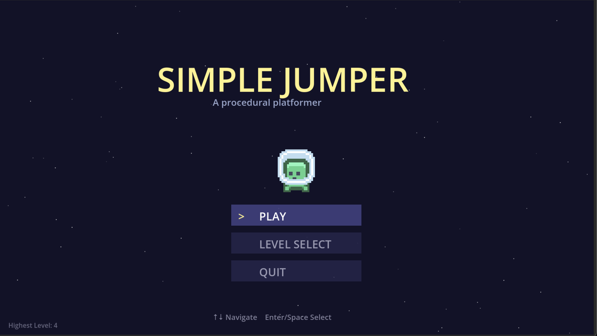

# SimpleJumper

A fast, addictive platformer where every level is randomly generated. Wall jump through saw blades, dash past bullet-spraying turrets, and stomp bosses across infinite procedural maps -- all built from scratch in Godot 4 with zero imported assets beyond Kenney sprites.



[](docs/game.mp4)

## Why Play This?

- **Every run is different.** 9 layout algorithms (zigzag, spiral, towers, maze, sky islands...) combine with scaling difficulty to keep things fresh.
- **Tight controls.** Coyote time, jump buffering, wall slides, dashes with afterimages, crouch-drops -- movement feels responsive and snappy.
- **One-more-level hook.** Star ratings, best times, and ability unlocks (triple jump at Lv5, longer dash at Lv10) give you a reason to push further.
- **Tons of variety.** Saw blades, crumbling platforms, ice, conveyors, wind zones, portals, shield pickups, speed boosts, 6 enemy types, and boss fights.

## Quick Start

```bash
# Clone and open in Godot 4.6
git clone https://github.com/huangbz/SimplePlatformer.git
cd SimplePlatformer
# Open project.godot in Godot 4.6, then press F5
```

Or just download the repo as a ZIP and open `project.godot` in Godot.

## Controls

| Key | Action |
|---|---|
| Arrow keys / `Left` `Right` | Move |
| `Space` or `Up` | Jump (double jump in air, triple at Lv5) |
| `Z` | Dash (longer at Lv10) |
| `Down` | Crouch / drop through platforms / enter portal |
| Hold toward wall in air | Wall slide, then jump to wall jump |
| `Scroll wheel` | Zoom in / out |
| `Esc` | Pause (shows all controls) |
| `1-4` | Switch difficulty (Easy / Medium / Hard / Extreme) |
| `R` | Reroll current map |
| `N` / `B` | Next / previous level |

## How It Works

Every level is procedurally generated at runtime:

1. **LevelData.gd** picks a random layout style and places platforms, enemies, hazards, coins, and keys based on the current difficulty tier.
2. **Builder.gd** is a static factory that constructs every game object from code -- no `.tscn` scene files for entities.
3. **World.gd** orchestrates gameplay: callbacks, level transitions, entity lifecycle.
4. **Player.gd** handles all movement, combat, and power-up logic with squash & stretch, camera shake, and freeze frames for game feel.

Bullets and particles are object-pooled (`BulletPool.gd`, `ParticlePool.gd`) to avoid allocation spikes. Audio is procedurally generated chiptune.

## Project Structure

```
scripts/
  World.gd          -- Orchestrator: state, callbacks, level switching
  Builder.gd        -- Static factory for all level elements
  Effects.gd        -- Particles, overlays, pause menu
  Player.gd         -- Player controller (movement, combat, power-ups)
  LevelData.gd      -- Procedural level generator (9 styles)
  GameState.gd      -- Autoload: level transitions, save data, unlocks
  SaveData.gd       -- Resource-based persistence (best times, stars)
  BulletPool.gd     -- Object pool for bullet reuse
  ParticlePool.gd   -- Object pool for GPU particle reuse
  CameraFX.gd       -- Cinematic camera (intro, boss tracking, death cam)
  AudioManager.gd   -- SFX pool + procedural music
  Portals.gd        -- Portal creation and teleport logic
  Minimap.gd        -- Minimap overlay
  Colors.gd         -- Color constants
  Sprites.gd        -- Kenney sprite textures and helpers
  entities/         -- Self-updating entity scripts (enemies, hazards, platforms)
```

## Requirements

- Godot 4.6 (GL Compatibility renderer)

## License

Sprites from [Kenney's Pixel Platformer](https://kenney.nl/assets/pixel-platformer). Everything else is original code.
